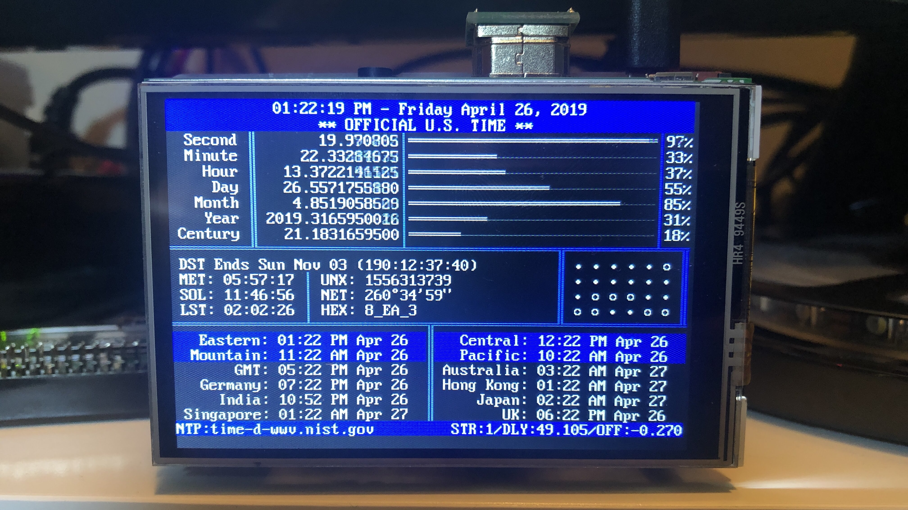

# Raspberry Pi Chronometer



Turn your RaspberryPi in to an [Internet Chronometer](https://www.reddit.com/r/raspberry_pi/comments/bb8ddc/made_a_rpi_desk_clock_as_a_means_of_learning/).

Display is a [UCTRONICS 3.5 Inch HDMI display](https://www.amazon.com/gp/product/B076M399XX).

### Features:

+ Utilizes system time via NTP.  All you need to provide is an internet connection.
+ Customizable banner that can changed in `config.xml`
+ Customizable world clock timezones that can changed in `config.xml`.  Timezones must be in pytz format:
    ```
    import pytz
    for tz in pytz.all_timezones:
        print(tz)
    ```

### Description
+ TOP:
    * Time value breakdown with exact values, completion bar, and percentage.
+ MIDDLE:
    * Daylight Savings Indicator
    * MET - [Metric Time](https://en.wikipedia.org/wiki/Metric_time)
    * SOL - [Solar Time](https://en.wikipedia.org/wiki/Solar_time)
    * LST - [Local Sidereal Time](https://en.wikipedia.org/wiki/Sidereal_time)
    * UNX - [Unix Epoch Time](https://en.wikipedia.org/wiki/Unix_time)
    * NET - [New Earth Time](https://en.wikipedia.org/wiki/New_Earth_Time)
    * HEX - [Hexadecimal Time](https://en.wikipedia.org/wiki/Hexadecimal_time)
    * [Binary Clock](https://en.wikipedia.org/wiki/Binary_clock)
+ BOTTOM:
    * World Clock
    * NTP status (Server, Stratum, Delay, Offset)

### Notes:

In order to get the display to work with this code, you need to set the resolution to 480x320, and set the console font to VGA 8x14.
NTP daemon needs to be running as a background service: `sudo apt install ntp`

### Required Python modules:

* `ephem`
* `pytz`

Modules can be install using `pip install [module]` or from your distros repositories.
